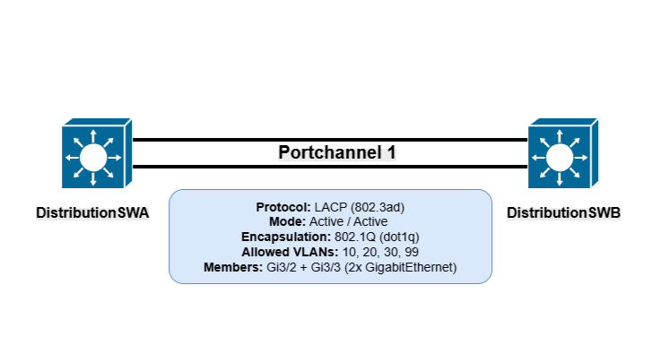

# LACP EtherChannel Configuration 

## Overview

This document describes the configuration and verification of a Layer 2 LACP EtherChannel (Port-Channel 1) between **Distribution Switch A (DistributionSWA)** and **Distribution Switch B (DistributionSWB)**.

### Configuration Summary

| Parameter | Value |
|-----------|-------|
| EtherChannel Protocol | LACP (IEEE 802.3ad / IEEE 802.1AX) |
| Port-Channel ID | 1 |
| Mode | Active |
| Port-Channel Type | Layer 2 Trunk |
| Member Interfaces | GigabitEthernet3/2, GigabitEthernet3/3 |
| Allowed VLANs | 10, 20, 30, 99 |
| Trunk Encapsulation | IEEE 802.1Q |

---

## Topology





---

## DistributionSWA

### Port-Channel Status

| Parameter | Value |
|----------|-------|
| Group | 1 |
| Port-Channel | Po1 |
| Protocol | LACP |
| State | Port-channel Ag-Inuse |
| Number of Member Ports | 2 |

### Member Interfaces

| Interface | Status |
|----------|--------|
| GigabitEthernet3/2 | Active |
| GigabitEthernet3/3 | Active |

Example output:

```text
Port-channel: Po1 (Primary Aggregator)

Port state : Port-channel Ag-Inuse
Protocol   : LACP

Ports in the Port-channel

Gi3/2  Active
Gi3/3  Active
```

---

## DistributionSWB

### Port-Channel Status

| Parameter | Value |
|----------|-------|
| Group | 1 |
| Port-Channel | Po1 |
| Protocol | LACP |
| State | Port-channel Ag-Inuse |
| Number of Member Ports | 2 |

### Member Interfaces

| Interface | Status |
|----------|--------|
| GigabitEthernet3/2 | Active |
| GigabitEthernet3/3 | Active |

Example output:

```text
Port-channel: Po1 (Primary Aggregator)

Port state : Port-channel Ag-Inuse
Protocol   : LACP

Ports in the Port-channel

Gi3/2  Active
Gi3/3  Active
```

---

# Operational Status

The verification output confirms that:

- LACP negotiation completed successfully.
- Both physical interfaces are bundled into **Port-Channel 1**.
- Both links are in the **Active** state.
- The Port-Channel is operational (**Ag-Inuse**).
- Traffic is forwarded across the aggregated links.
- VLANs **10, 20, 30, and 99** are permitted on the trunk.
