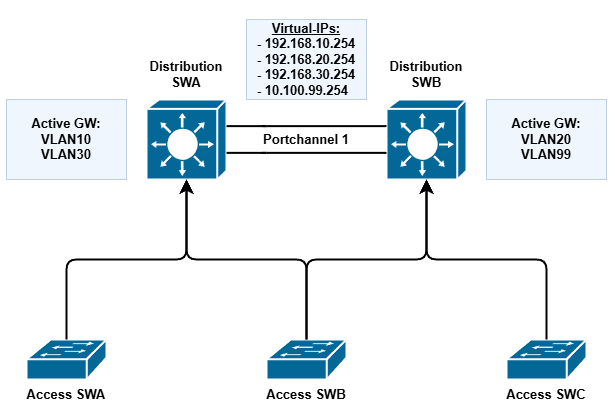

# HSRP Configuration

## Overview

The distribution layer switches (`DistributionSWA` and `DistributionSWB`) run **HSRP version 2** to provide a redundant default gateway for each VLAN. Active/Standby roles are deliberately split across the two switches to load-share gateway traffic between them, and are aligned with the Spanning Tree root bridge placement for each VLAN (see [STP Alignment](#stp-alignment) below).

| VLAN | Group | Virtual IP       | Active GW       | Standby GW       |
|------|-------|------------------|------------------|------------------|
| 10   | 10    | 192.168.10.254   | DistributionSWA  | DistributionSWB  |
| 20   | 20    | 192.168.20.254   | DistributionSWB  | DistributionSWA  |
| 30   | 30    | 192.168.30.254   | DistributionSWA  | DistributionSWB  |
| 99   | 99    | 10.100.99.254    | DistributionSWB  | DistributionSWA  |

**Summary:**
- **DistributionSWA** is the active gateway for **VLAN 10** and **VLAN 30**.
- **DistributionSWB** is the active gateway for **VLAN 20** and **VLAN 99**.



## Configuration

### DistributionSWA

```
interface Vlan10
 standby version 2
 standby 10 ip 192.168.10.254
 standby 10 priority 110
 standby 10 preempt
!
interface Vlan20
 standby version 2
 standby 20 ip 192.168.20.254
 standby 20 preempt
!
interface Vlan30
 standby version 2
 standby 30 ip 192.168.30.254
 standby 30 priority 110
 standby 30 preempt
!
interface Vlan99
 standby version 2
 standby 99 ip 10.100.99.254
 standby 99 preempt
```

### DistributionSWB

```
interface Vlan10
 standby version 2
 standby 10 ip 192.168.10.254
 standby 10 preempt
!
interface Vlan20
 standby version 2
 standby 20 ip 192.168.20.254
 standby 20 priority 110
 standby 20 preempt
!
interface Vlan30
 standby version 2
 standby 30 ip 192.168.30.254
 standby 30 preempt
!
interface Vlan99
 standby version 2
 standby 99 ip 10.100.99.254
 standby 99 priority 110
 standby 99 preempt
```

## Verification

```
DistributionSWA#show standby brief

Interface   Grp  Pri P State   Active          Standby         Virtual IP
Vl10        10   110 P Active  local           192.168.10.2    192.168.10.254
Vl20        20   100 P Standby 192.168.20.2    local           192.168.20.254
Vl30        30   110 P Active  local           192.168.30.2    192.168.30.254
Vl99        99   100 P Standby 10.100.99.3     local           10.100.99.254

DistributionSWB#show standby brief

Interface   Grp  Pri P State   Active          Standby         Virtual IP
Vl10        10   100 P Standby 192.168.10.1    local           192.168.10.254
Vl20        20   110 P Active  local           192.168.20.1    192.168.20.254
Vl30        30   100 P Standby 192.168.30.1    local           192.168.30.254
Vl99        99   110 P Active  local           10.100.99.2     10.100.99.254
```

## STP Alignment

The HSRP active/standby roles are intentionally synchronized with the Spanning Tree root bridge placement, so that the gateway for each VLAN is co-located with the STP root for that same VLAN. This avoids unnecessary traffic hair-pinning across the inter-switch trunk between DistributionSWA and DistributionSWB.

| VLAN | STP Root Bridge  | HSRP Active Gateway |
|------|------------------|----------------------|
| 10   | DistributionSWA  | DistributionSWA       |
| 20   | DistributionSWB  | DistributionSWB       |
| 30   | DistributionSWA  | DistributionSWA       |
| 99   | DistributionSWB  | DistributionSWB       |

- **DistributionSWA** is the root bridge for **VLAN 10** and **VLAN 30**.
- **DistributionSWB** is the root bridge for **VLAN 20** and **VLAN 99**.

This alignment ensures that, for each VLAN, both the Layer 2 forwarding path (STP root) and the Layer 3 gateway (HSRP active) point to the same switch — keeping traffic flow efficient and predictable under normal operating conditions.
