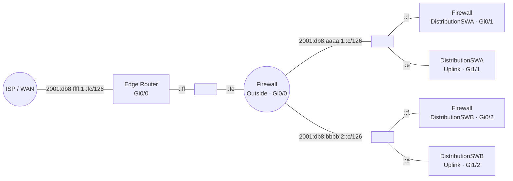

# IPv6 Documentation – Edge Router / Firewall / Distribution Uplinks

This document describes the **IPv6 addressing design** for the transit links between the edge router, the firewall, and the two distribution switches (`DistributionSWA`, `DistributionSWB`).

## Topology



## IPv6 Addressing Plan

All transit links are **point-to-point links** and deliberately use a **/126 prefix** (4 addresses, 2 of which are usable for host endpoints) — the recommended practice for IPv6 P2P links (RFC 6164).

| Segment | Prefix | Device | Interface | IPv6 Address | Role |
|---|---|---|---|---|---|
| WAN Transit | `2001:db8:ffff:1::fc/126` | Edge Router | Gi0/0 | `2001:db8:ffff:1::ff` | WAN-facing (ISP-facing) |
| WAN Transit | `2001:db8:ffff:1::fc/126` | Firewall | Gi0/0 (`Outside`) | `2001:db8:ffff:1::fe` | Firewall Outside |
| Transit to SWA | `2001:db8:aaaa:1::c/126` | Firewall | Gi0/1 (`DistributionSWA`) | `2001:db8:aaaa:1::f` | Firewall side |
| Transit to SWA | `2001:db8:aaaa:1::c/126` | DistributionSWA | Gi1/1 (Uplink to Firewall) | `2001:db8:aaaa:1::e` | Switch side |
| Transit to SWB | `2001:db8:bbbb:2::c/126` | Firewall | Gi0/2 (`DistributionSWB`) | `2001:db8:bbbb:2::f` | Firewall side |
| Transit to SWB | `2001:db8:bbbb:2::c/126` | DistributionSWB | Gi1/2 (Uplink to Firewall) | `2001:db8:bbbb:2::e` | Switch side |

> **Note:** On `DistributionSWB` (Gi1/2), `ipv6 address autoconfig` is configured in addition to the static address. This is normally unnecessary/unintended on a P2P uplink with fixed addressing and should be reviewed and likely removed, to avoid an unwanted SLAAC-derived address appearing on this interface.

## Configuration Details

### Edge Router – GigabitEthernet0/0 (WAN)
```
interface GigabitEthernet0/0
 ip address 10.0.0.2 255.255.255.252
 ip ospf authentication
 ip ospf authentication-key edv12345
 ip ospf network point-to-point
 duplex auto
 speed auto
 media-type rj45
 ipv6 address 2001:DB8:FFFF:1::FF/126
```

### Firewall – GigabitEthernet0/0 (`Outside`)
```
interface GigabitEthernet0/0
 nameif Outside
 security-level 0
 ip address 10.0.0.1 255.255.255.252
 ipv6 address 2001:db8:ffff:1::fe/126
 ospf cost 1
 ospf network point-to-point non-broadcast
 ospf authentication-key *****
 ospf authentication
```

### Firewall – GigabitEthernet0/1 (`DistributionSWA`)
```
interface GigabitEthernet0/1
 nameif DistributionSWA
 security-level 100
 ip address 10.100.1.1 255.255.255.252
 ipv6 address 2001:db8:aaaa:1::f/126
 ospf cost 10
 ospf network point-to-point non-broadcast
 ospf authentication-key *****
 ospf authentication
```

### Firewall – GigabitEthernet0/2 (`DistributionSWB`)
```
interface GigabitEthernet0/2
 nameif DistributionSWB
 security-level 100
 ip address 10.200.2.1 255.255.255.252
 ipv6 address 2001:db8:bbbb:2::f/126
 ospf cost 10
 ospf network point-to-point non-broadcast
 ospf authentication-key *****
 ospf authentication
```

### DistributionSWA – GigabitEthernet1/1 (Uplink to Firewall)
```
interface GigabitEthernet1/1
 description Uplink_Firewall
 no switchport
 ip address 10.100.1.2 255.255.255.252
 ip ospf authentication
 ip ospf authentication-key edv12345
 ip ospf network point-to-point
 negotiation auto
 ipv6 address 2001:DB8:AAAA:1::E/126
```

### DistributionSWB – GigabitEthernet1/2 (Uplink to Firewall)
```
interface GigabitEthernet1/2
 description Uplink_Firewall
 no switchport
 ip address 10.200.2.2 255.255.255.252
 ip ospf authentication
 ip ospf authentication-key edv12345
 ip ospf network point-to-point
 negotiation auto
 ipv6 address 2001:DB8:BBBB:2::E/126
 ipv6 address autoconfig
```

## Notes on IPv6 & OSPF

- All links are configured with OSPF network type **`point-to-point`** — correct for pure P2P transit links, since no DR/BDR election is required and convergence is faster.
- The existing `ip ospf authentication` / `ospf authentication` commands apply exclusively to **OSPFv2 (IPv4)**. Routing IPv6 dynamically requires **OSPFv3** (`ipv6 router ospf`, `ipv6 ospf ... area ...`), which is not present in the configuration shown. If IPv6 routes are meant to be exchanged dynamically via OSPF, this must be configured separately (including its own IPv6/OSPFv3 authentication — OSPFv3 uses IPsec-based authentication rather than the cleartext password used by OSPFv2).
- All IPv6 prefixes come from the **documentation address space `2001:db8::/32`** (RFC 3849) and must be replaced with real, assigned prefixes before production use.
- Consistent use of `/126` across all P2P links simplifies automation and address planning (each subnet uses `::e`/`::f` or `::fe`/`::ff` as host addresses).

## Open Items / To-Do

- [ ] Review `ipv6 address autoconfig` on `DistributionSWB` Gi1/2 and remove if not intended (conflicts with the static address).
- [ ] Add OSPFv3 configuration for IPv6 routing, if IPv6 routes are meant to be dynamically routed.
- [ ] Replace `2001:db8::/32` (documentation range) with real IPv6 prefixes for production use.