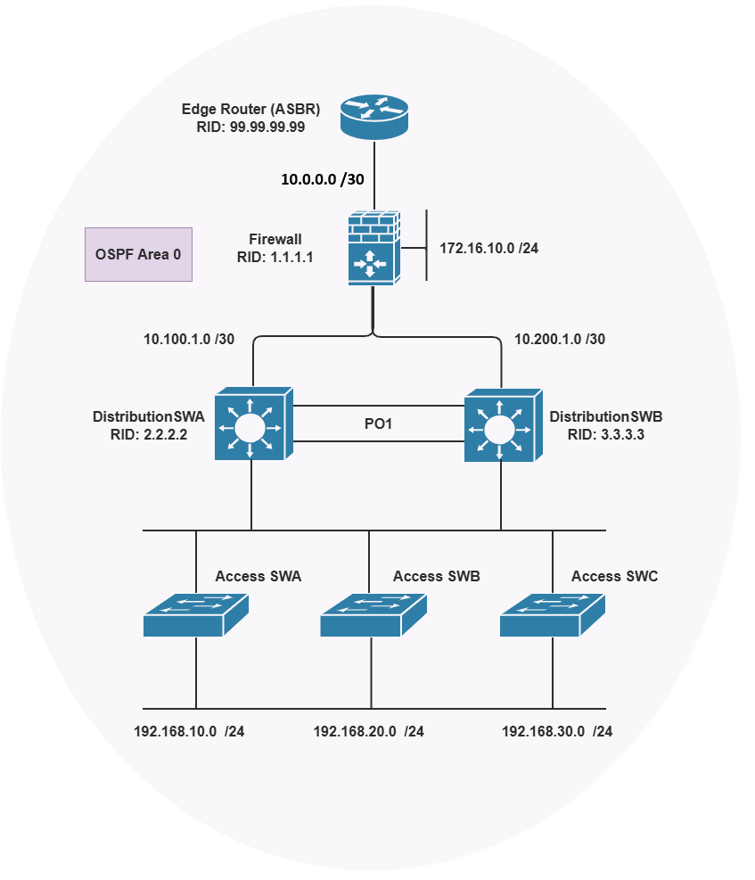

# OSPF Single-Area Lab – Dokumentation

Dieses Repository dokumentiert ein kleines OSPF-Labor mit **einer einzigen Area (Area 0 / Backbone)**, bestehend aus einem Edge Router (ASBR), einer Firewall, zwei Distribution-Switches (redundant per Port-Channel und dreifachem SVI-Uplink verbunden) sowie drei Access-Switches mit jeweils eigenem VLAN/Subnetz.



## Inhalt

- [Topologie-Übersicht](#topologie-übersicht)
- [Geräte & Router-IDs](#geräte--router-ids)
- [IP-Adressierung / Subnetze](#ip-adressierung--subnetze)
- [OSPF-Design](#ospf-design)
- [Verifizierung (Zusammenfassung)](#verifizierung-zusammenfassung)
- [Auffälligkeiten / Hinweise](#auffälligkeiten--hinweise)
- [Dateien in diesem Repo](#dateien-in-diesem-repo)

---

## Topologie-Übersicht

```
                    Edge Router (ASBR)
                      RID 99.99.99.99
                            |
                        Firewall
                       RID 1.1.1.1
                            |
              10.100.1.0/30    10.200.2.0/30
                    |                  |
          DistributionSWA ==PO1== DistributionSWB
            RID 2.2.2.2            RID 3.3.3.3
                    |                  |
        +-----------+------------------+-----------+
        |                    |                      |
  Access SWA           Access SWB              Access SWC
  VLAN10               VLAN20                  VLAN30
  192.168.10.0/24      192.168.20.0/24         192.168.30.0/24
```

Alle Geräte befinden sich in **einer einzigen OSPF Area 0**. DistributionSWA und DistributionSWB sind zusätzlich über einen Port-Channel (PO1) sowie über die drei Access-VLANs (VLAN10/20/30) und ein Management-VLAN (VLAN99, 10.100.99.0/24) miteinander vermascht – dadurch entstehen mehrere gleichwertige OSPF-Pfade zwischen den beiden Distribution-Switches.

## Geräte & Router-IDs

Die Router-ID entspricht bei jedem Gerät der Loopback-Adresse.

| Gerät             | Rolle                          | Router-ID (Loopback) |
|-------------------|--------------------------------|-----------------------|
| Edge Router        | ASBR (Redistribution/Default)  | 99.99.99.99          |
| Firewall           | Internal Router (Area 0)       | 1.1.1.1               |
| DistributionSWA    | Internal Router (Area 0)       | 2.2.2.2               |
| DistributionSWB    | Internal Router (Area 0)       | 3.3.3.3               |
| Access SWA/SWB/SWC | Layer-2-Access (kein OSPF)      | –                     |

## IP-Adressierung / Subnetze

| Netz                | Beschreibung                                  |
|---------------------|------------------------------------------------|
| 172.16.10.0/24      | DMZ am Firewall                                 |
| 10.100.1.0/30       | P2P Firewall ↔ DistributionSWA                  |
| 10.200.2.0/30       | P2P Firewall ↔ DistributionSWB                  |
| 10.0.0.0/30         | P2P Firewall ↔ Edge Router ("Outside")          |
| 10.100.99.0/24      | VLAN99 – Management-/Transit-Link SWA ↔ SWB     |
| 192.168.10.0/24     | VLAN10 – Access SWA                             |
| 192.168.20.0/24     | VLAN20 – Access SWB                             |
| 192.168.30.0/24     | VLAN30 – Access SWC                             |
| 192.168.178.0/24    | Außennetz am Edge Router (Richtung Internet)    |

## OSPF-Design

- **Prozess:** `router ospf 1` auf allen Geräten
- **Areas:** ausschließlich **Area 0** (Backbone) – kein Multi-Area-Design
- **ASBR:** Der **Edge Router** (RID 99.99.99.99) redistributiert eine externe Default-Route (`0.0.0.0/0`) als **O\*E2** in OSPF – erkennbar an `E2`-Routen mit fester Metrik `[110/1]` auf allen anderen Geräten
- **Maximum Paths:** 4 (Default bei Cisco IOS) – ermöglicht Equal-Cost-Multipath (ECMP), was sich in den Routing-Tabellen von DistributionSWA/SWB zeigt (4 gleichwertige Pfade zu Loopback des jeweils anderen Distribution-Switches, u. a. über VLAN10/20/30/99 sowie PO1)
- **Redundanz:** DistributionSWA und DistributionSWB sehen sich gegenseitig über **vier** OSPF-Nachbarschaften/Pfade (VLAN10, VLAN20, VLAN30, VLAN99), zusätzlich zum physischen Port-Channel PO1

## Verifizierung (Zusammenfassung)

**`sh ip route` auf DistributionSWA (RID 2.2.2.2):**
- Default-Route (O\*E2) über GigabitEthernet1/1 (Richtung Firewall)
- 3.3.3.3 (DistributionSWB) über 4 gleichwertige Pfade erreichbar (ECMP)
- Alle lokalen VLANs (10/20/30) sowie Management-VLAN99 als **C/L** (directly connected)

**`sh ip route` auf DistributionSWB (RID 3.3.3.3):**
- Spiegelbildlich zu SWA: Default-Route über GigabitEthernet1/2 (Richtung Firewall)
- 2.2.2.2 (DistributionSWA) über 4 gleichwertige Pfade erreichbar

**`sh route` auf der Firewall (RID 1.1.1.1):**
- Empfängt Default-Route vom Edge Router (Outside-Interface)
- Kennt beide Distribution-Switches sowie alle Access-Subnetze über OSPF

**`sh ip route` auf Edge Router (RID 99.99.99.99):**
- Statische Default-Route ins Internet (`S*`) über GigabitEthernet0/15
- Kennt über OSPF alle internen Netze (172.16.10.0 fehlt hier interessanterweise – siehe Hinweise)

## Auffälligkeiten / Hinweise

- Das **172.16.10.0/24 DMZ-Netz** der Firewall taucht in der Routing-Tabelle des Edge Routers **nicht** auf – es wird vermutlich nicht in OSPF beworben (`network`-Statement fehlt) oder ist absichtlich nicht redistributiert.
- Die externe Default-Route wird als **OSPF External Type 2 (E2)** verteilt – die Metrik bleibt daher auf allen Hops konstant bei `[110/1]`, unabhängig von der tatsächlichen internen Kostensumme.
- Auf DistributionSWA/SWB sorgt die Vermaschung über VLAN10/20/30/99 für **ECMP mit bis zu 4 Pfaden** zwischen den beiden Distribution-Switches – Ausfall eines VLAN-Uplinks oder des Port-Channels führt nicht zum Verbindungsverlust.
- Loopback0 wird konsistent für die Router-ID sowie als stabiler Prüfpunkt für Erreichbarkeit genutzt (2.2.2.2, 3.3.3.3, 99.99.99.99).

## Dateien in diesem Repo

| Datei                     | Inhalt                                                        |
|---------------------------|----------------------------------------------------------------|
| `README.md`               | Diese Dokumentation                                             |
| `raw-cli-output.txt`      | Alle rohen `show ip route` / `show ip protocols` Ausgaben       |
| `OSPF_Topology.png`       | Topologie-Diagramm                                              |

---
*Dokumentation erstellt zur Nachverfolgung/Archivierung des OSPF-Labs für GitHub.*
